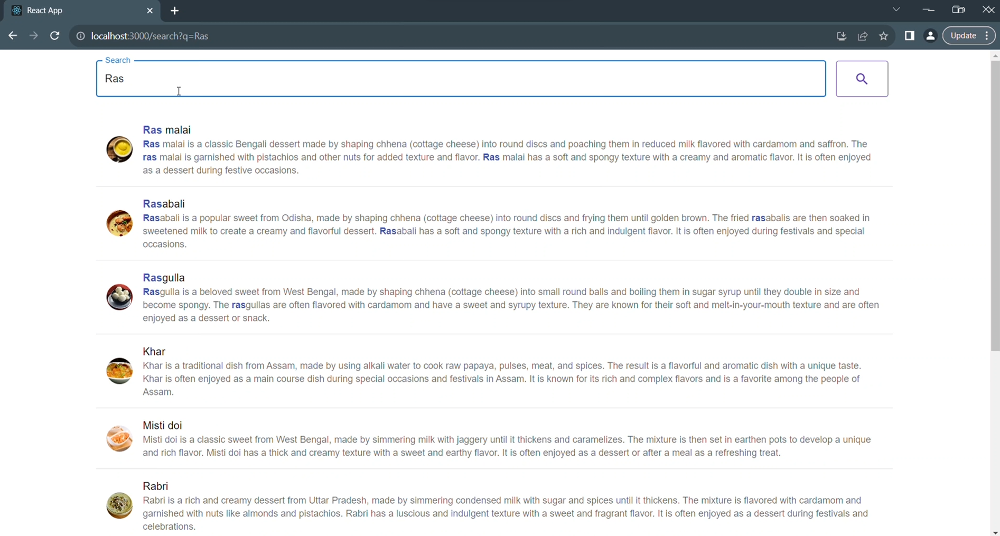
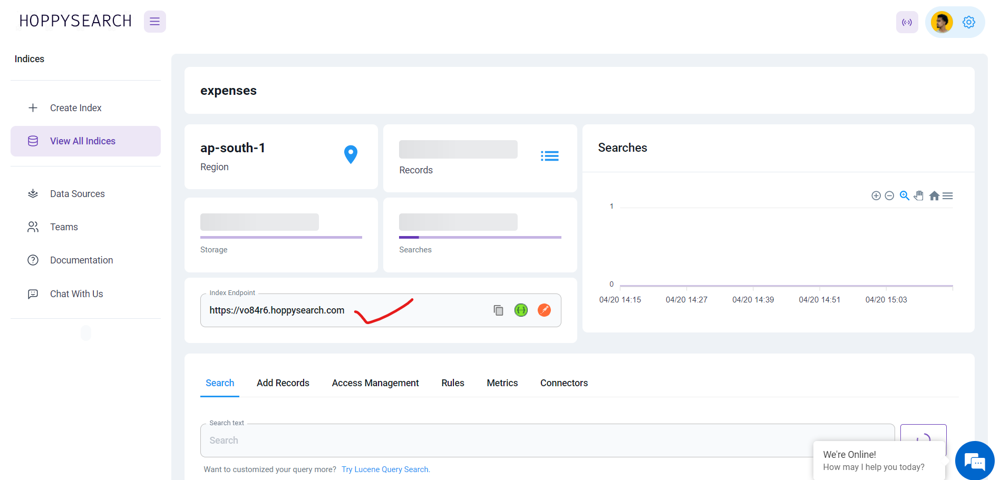
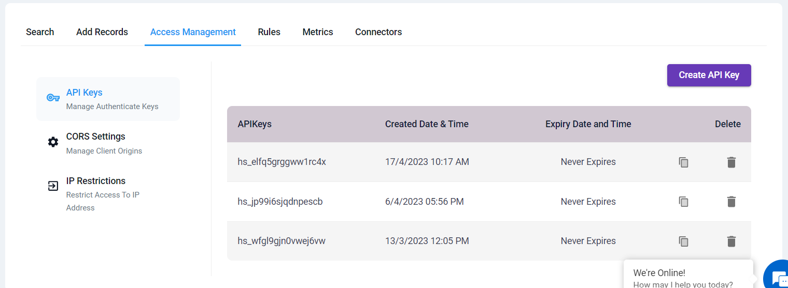

# React Connector

hoppysearch - React Js client for hoppysearch

Explore your React Search Page enhanced by the 'hs-search-page' component. This robust functionality facilitates effortless searches complete with automatic suggestions, offering users an intuitive browsing experience. Tailor text appearances, integrate optional links and icons, and offer users a dynamic search interface for enhanced usability.



To achieve this follow below instructions.

## Installation

This project was generated with [React js](https://react.dev/learn/start-a-new-react-project) version 18.2.0

### For [React.js](https://react.dev/learn/start-a-new-react-project)

Proceed with the installation by following these steps:

1. Begin by installing "hs-search-page" in your existing React project. For more information, visit (https://www.npmjs.com/package/hs-search-page).

    #### cmd

    ```Javascript
    npm i hs-search-page
    ```

2. Import the HSSearchPage component in your project:

    #### cmd

    ```javascript
    import HSSearchPage from "hs-search-page";
    ```

3. Utilize the component in your project as demonstrated below:

    ### JavaScript
    ```javascript
    <HSSearchPage
      indexId={"YOUR INDEX ID"}    
      apiKey={"YOUR READ/WRITE API KEY"}   
      primaryText={""}    
      secondaryText={""}    
      targetURL={""}    
      iconURL={""}    
      onTypeSearch={true}
    />
    ```

4. Here's where to find the required information:

   1. Visit to /indices page(https://hoppysearch.com/indices) and select the index on which you want to apply connector.
   
   2. **indexId**: Retrieve your index ID from your index endpoint. For instance, if your index endpoint is (https://unm8df.hoppysearch.com) your index ID is "unm8df."

    

   3. **apiKey**: Access Management -> API Keys section will provide you with the necessary API key.

    

   4. **onTypeSearch**: Choose between "true" (automatic search as you type) or "false" (manual search by clicking the search button).

   5. **primaryText, secondaryText, targetURL, iconURL**: 
   
    1. Customize these fields according to your dataset. For example, if you have data like this:

          ### JSON

             ```javascript
                {
                   "documents": [
                      {
                         "Id": 12,
                         "ProductId": "B001M1L12M",
                         "UserId": "A27KQ4QYY0O334",
                         "ProfileName": "R. Strom",
                         "HelpfulnessNumerator": 0,
                         "HelpfulnessDenominator": 0,
                         "Score": 5,
                         "Time": 1258502400,
                         "Summary": "super black does the job",
                         "Text": "As with the Americolor red, red, super black works exceptionally well."
                       },
                     // Add more records as needed...
                   ],
                   "config": {
                       "type": "append"
                    }
                }
             ```
    2. Set these fields as follows:

        1. targetURL=url
        2. iconURL=image
        3. primaryText=name
        4. secondaryText=about

    3. You can modify it according to you dataset and requirements. targetURL and secondaryText are optional field.

#### For a step-by-step visual guide on implementing "hs-search-page" in your React project, watch this [YouTube video.](https://youtu.be/ukECXrxcvm0)


